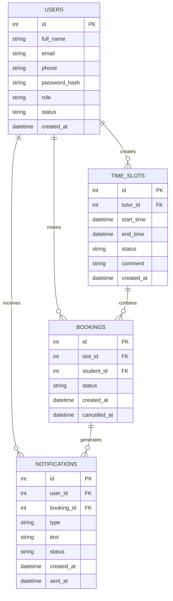

# Модель данных

## 1. Общая информация

В документе описана логическая модель данных системы онлайн-записи учеников на занятия к репетиторам.

Модель данных показывает основные сущности системы, их атрибуты и связи между ними.

В первой версии системы используются следующие основные сущности:

* пользователь;
* временной слот;
* запись на занятие;
* уведомление.

## 2. Основные сущности

| Сущность     | Описание                                                                       |
| ------------ | ------------------------------------------------------------------------------ |
| User         | Пользователь системы. Может иметь роль ученика, репетитора или администратора. |
| TimeSlot     | Временной слот, созданный репетитором для записи на занятие.                   |
| Booking      | Запись ученика на временной слот.                                              |
| Notification | Уведомление пользователя о записи или отмене занятия.                          |

## 3. Описание сущностей

### 3.1. User

Сущность `User` хранит данные пользователей системы.

| Поле          | Тип данных | Описание                                        |
| ------------- | ---------- | ----------------------------------------------- |
| id            | integer    | ID пользователя.                                |
| full_name     | string     | ФИО пользователя.                               |
| email         | string     | Email пользователя.                             |
| phone         | string     | Номер телефона пользователя.                    |
| password_hash | string     | Хэш пароля пользователя.                        |
| role          | enum       | Роль пользователя: `student`, `tutor`, `admin`. |
| status        | enum       | Статус учётной записи: `active`, `blocked`.     |
| created_at    | datetime   | Дата и время создания учётной записи.           |

### 3.2. TimeSlot

Сущность `TimeSlot` хранит временные слоты, созданные репетитором.

| Поле       | Тип данных | Описание                                     |
| ---------- | ---------- | -------------------------------------------- |
| id         | integer    | ID временного слота.                         |
| tutor_id   | integer    | ID репетитора, который создал слот.          |
| start_time | datetime   | Дата и время начала слота.                   |
| end_time   | datetime   | Дата и время окончания слота.                |
| status     | enum       | Статус слота: `free`, `booked`, `cancelled`. |
| comment    | string     | Комментарий репетитора к слоту.              |
| created_at | datetime   | Дата и время создания слота.                 |

### 3.3. Booking

Сущность `Booking` хранит информацию о записи ученика на занятие.

| Поле         | Тип данных | Описание                                                                            |
| ------------ | ---------- | ----------------------------------------------------------------------------------- |
| id           | integer    | ID записи на занятие.                                                               |
| slot_id      | integer    | ID временного слота.                                                                |
| student_id   | integer    | ID ученика, который записался на занятие.                                           |
| status       | enum       | Статус записи: `active`, `cancelled_by_student`, `cancelled_by_tutor`, `completed`. |
| created_at   | datetime   | Дата и время создания записи.                                                       |
| cancelled_at | datetime   | Дата и время отмены записи.                                                         |

### 3.4. Notification

Сущность `Notification` хранит уведомления пользователей.

| Поле       | Тип данных | Описание                                                                                          |
| ---------- | ---------- | ------------------------------------------------------------------------------------------------- |
| id         | integer    | ID уведомления.                                                                                   |
| user_id    | integer    | ID пользователя, которому отправлено уведомление.                                                 |
| booking_id | integer    | ID записи на занятие, связанной с уведомлением.                                                   |
| type       | enum       | Тип уведомления: `booking_created`, `booking_cancelled_by_student`, `booking_cancelled_by_tutor`. |
| text       | string     | Текст уведомления.                                                                                |
| status     | enum       | Статус уведомления: `created`, `sent`, `failed`.                                                  |
| created_at | datetime   | Дата и время создания уведомления.                                                                |
| sent_at    | datetime   | Дата и время отправки уведомления.                                                                |

## 4. ER - модель

## 5. Бизнес-правила данных

* Один пользователь может иметь только одну роль в системе.
* Пользователь со статусом `blocked` не может войти в систему.
* Репетитор может создавать и редактировать только свои временные слоты.
* Ученик может записаться только на свободный временной слот.
* Один временной слот может иметь только одну активную запись.
* Нельзя создать запись на слот, который уже занят.
* Нельзя создать запись на прошедшее время.
* Нельзя отменить запись или занятие, если время занятия уже прошло.
* После записи ученика статус временного слота меняется на `booked`.
* После отмены записи учеником статус временного слота меняется на `free`.
* После отмены занятия репетитором статус записи меняется на `cancelled_by_tutor`.
* Информация об отменённых занятиях сохраняется в истории занятий.
* Уведомления создаются после записи ученика на занятие и после отмены записи или занятия.
